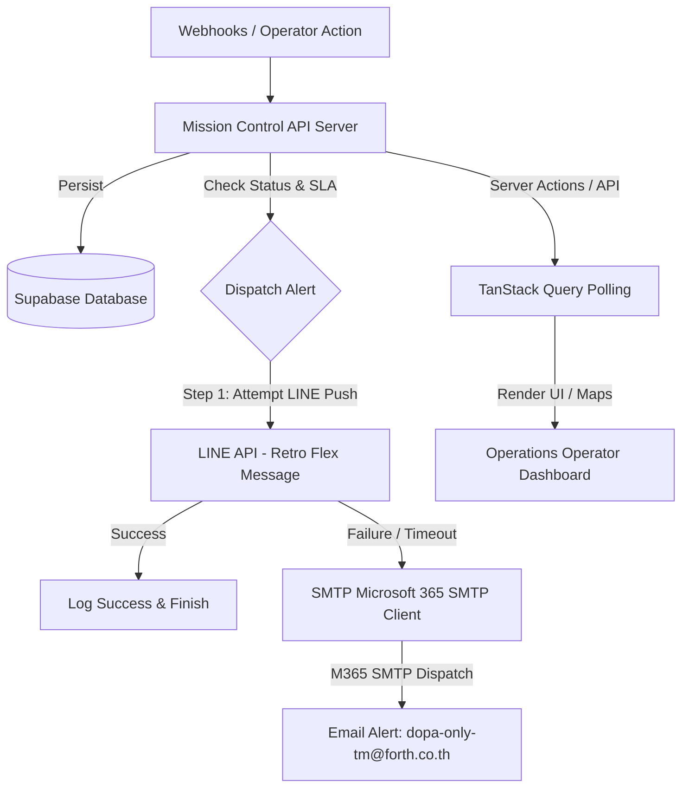

# 🛰️ NEXCORE Mission Control

แดชบอร์ดปฏิบัติการ (Operational Dashboard) ระดับองค์กร สำหรับตรวจสอบสถานะสถานี (Station State) และควบคุมลำดับเหตุการณ์ขัดข้อง (Incident Flow) ออกแบบมาโดยเฉพาะสำหรับ **Operations Operator** เพื่อช่วยในการประเมิน เฝ้าระวัง และแก้ไขปัญหาทางโครงสร้างพื้นฐานได้อย่างทันท่วงทีและมีประสิทธิภาพสูงสุด

---

## 🌟 คุณสมบัติหลัก (Key Features)

- **🗺️ Interactive Map (Leaflet):** แผนที่แสดงตำแหน่งสถานี (Station) พร้อมไอคอนเปลี่ยนสีตามสถานะการทำงาน และแสดงจุดเกิดเหตุ (Incident Overlay) แบบ real-time
- **🚨 Incident Queue & Management:** ลำดับคิวเหตุการณ์ที่กรองได้ตามระดับความรุนแรง (Severity), สถานะ (Status), รหัสสถานี (Station ID) และข้อความค้นหาอิสระ (Free-text search) ผ่าน Web Workers
- **⚡ SLA Tracking & Alerting:** ระบบเฝ้าระวังระยะเวลาในการให้บริการ (SLA) และสถานะการตอบรับพร้อมระบุการแจ้งเตือนที่ล้าช้า
- **💬 LINE Flex Message Push Notification:** ส่งการแจ้งเตือนรูปแบบ Flex Message ไปยังกลุ่ม LINE Operations อัตโนมัติ โดยใช้ Palette สไตล์ **Retro-neon** เพื่อบอกความรุนแรง พร้อมปุ่มโทรออกด่วน (Telephony Quick-Dial) สำหรับดำเนินการทันที
- **📧 Email Fallback Notification:** ระบบสำรองส่ง HTML Alert ผ่าน Microsoft 365 SMTP ไปยัง `dopa-only-tm@forth.co.th` หากเกิดกรณี LINE API ล้มเหลว, โควต้าหมด หรือเกินเวลาตอบสนองที่กำหนด
- **🔒 Server-First Security Architecture (Auth.js):** สถาปัตยกรรมที่ปลอดภัยและแยกสิทธิ์เข้าถึง Supabase ไว้เฉพาะฝั่ง Server เท่านั้น โดยไคลเอนต์คอมโพเนนต์จะไม่มีการเชื่อมต่อกับ Supabase หรือถือ Client Key โดยตรง

---

## 🛠️ เทคโนโลยีหลักที่ใช้ (Technology Stack)

| Layer | Technology | Description |
| --- | --- | --- |
| **Framework** | Next.js 16 (App Router) | โครงสร้างแบบเซิร์ฟเวอร์นำและระบบ Dynamic Routing |
| **Runtime** | React 19 | เพิ่มประสิทธิภาพการจัดเรียง UI และการจัดการ State |
| **Styling** | Tailwind CSS v4 + shadcn/ui | ระบบ Design System ยุคใหม่ที่คอมไพล์เร็วและยืดหยุ่น |
| **Database & Auth** | Supabase & Auth.js | ฐานข้อมูลหลักพร้อมระบบการเข้าสู่ระบบที่ปลอดภัย |
| **Mapping Engine** | Leaflet + react-leaflet | แผนที่ประสิทธิภาพสูงพร้อมรองรับ SSR-safety |
| **Caching/Fetching** | TanStack Query (React Query) | จัดการ Server State Caching, Dynamic Polling และ Mutations |
| **Task Runner** | Bun | ระบบติดตั้ง package และชุดรัน script ที่รวดเร็ว |

---

## 🗺️ สถาปัตยกรรมข้อมูลและการแจ้งเตือน (Architecture Flow)



---

## 🚀 การเริ่มต้นพัฒนาบนเครื่อง Local (Getting Started)

### 1. ติดตั้ง Dependencies
ใช้ [Bun](https://bun.sh/) ในการติดตั้งชุดคำสั่งและทำงานร่วมกับโปรเจกต์:
```bash
bun install
```

### 2. ตั้งค่าตัวแปรสภาพแวดล้อม (Environment Variables)
คัดลอกไฟล์ `.env.example` เพื่อสร้างไฟล์คอนฟิกบนเครื่อง Local:
```bash
cp .env.example .env.local
```

จากนั้นแก้ไขค่าต่าง ๆ ใน `.env.local` ตามความต้องการ:
```env
# Authentication Configuration
AUTH_SECRET="your-generated-auth-secret-here"

# Supabase Server-Only Database (ปล่อยว่างไว้หากต้องการใช้ Mock Data)
SUPABASE_URL="https://your-project.supabase.co"
SUPABASE_SERVICE_ROLE_KEY="sb_secret_service_role_key_here"

# Notification Configurations (LINE & SMTP)
LINE_CHANNEL_ACCESS_TOKEN="your_line_token"
SMTP_HOST="smtp.office365.com"
SMTP_USER="notification@company.com"
```

> [!IMPORTANT]
> หากไม่ได้ระบุค่า Supabase ใน `.env.local` ระบบจะเปลี่ยนไปใช้งาน **Mock Storage Layer** (`src/lib/mission-control/mock-store.ts`) โดยอัตโนมัติ เพื่อให้สามารถเปิดใช้งานและทดสอบในเครื่อง Local ได้ทันทีโดยไม่ต้องเชื่อมฐานข้อมูลจริง

### 3. รันแอปพลิเคชันเวอร์ชันพัฒนา
```bash
bun run dev
```

เปิดเว็บเบราว์เซอร์ไปที่: **`http://localhost:3000/mission-control`**

---

## 🔑 บัญชีผู้ใช้สำหรับทดสอบ (Demo Operator Credentials)

สามารถล็อกอินเข้าสู่แดชบอร์ดระบบด้วยบัญชีดังต่อไปนี้:

* **Email:** `operator@nexcore.local`
* **Password:** `mission-control`

> [!TIP]
> คุณสามารถปรับเปลี่ยนอีเมลและรหัสผ่านเริ่มต้นของระบบได้โดยระบุค่า `DEMO_OPERATOR_EMAIL` และ `DEMO_OPERATOR_PASSWORD` ไว้ใน `.env.local`

---

## 📂 โครงสร้างโฟลเดอร์ของโปรเจกต์ (Project Directory Structure)

```
NEXCORE/
├── src/
│   ├── components/
│   │   └── mission-control/
│   │       ├── IncidentCreateDrawer.tsx   # ลิ้นชักกรอกข้อมูลสร้าง Incident
│   │       ├── IncidentCreateForm.tsx     # ฟอร์มหลักสำหรับกรอกข้อมูลและเลือกรหัสพิกัด
│   │       ├── mission-control-dashboard.tsx # หน้าจอแดชบอร์ดหลักของห้องควบคุม
│   │       └── mission-control-map.tsx    # แผนที่ Leaflet แสดงพิกัดสถานี
│   ├── lib/
│   │   └── mission-control/
│   │       ├── api.ts                     # ฟังก์ชัน HTTP Request ฝั่ง Client
│   │       ├── line-client.ts             # ส่วนติดต่อสื่อสารและ Push LINE API
│   │       ├── smtp-client.ts             # Microsoft 365 SMTP Client สำหรับส่งเมลสำรอง
│   │       ├── sla.ts                     # ตรรกะคำนวณและประมวลผลช่วงเวลา SLA
│   │       ├── search.worker.ts           # การประมวลผลข้อความค้นหาเบื้องหลังด้วย Web Worker
│   │       ├── mission-control-repository.ts # Repository Pattern สลับ Supabase / Mock อัตโนมัติ
│   │       └── types.ts                   # โครงสร้าง Type ต่าง ๆ ของระบบ
├── tests/                                 # สำหรับเก็บ Playwright E2E tests
└── package.json                           # การจัดการ dependencies และ scripts
```

---

## 🧪 การทดสอบและตรวจสอบความถูกต้องของระบบ (Verification)

เพื่อรักษาคุณภาพและความสมบูรณ์ของ Source Code คุณควรทำการรันคำสั่งเหล่านี้ก่อนทำการ Push โค้ดขึ้นสู่ Repository:

```bash
# ตรวจสอบ TypeScript Types ของทั้งระบบ
bun run type-check

# ตรวจสอบโครงสร้างและรูปแบบโค้ด (Linting)
bun run lint

# รัน Unit Tests ด้วย Vitest
bun run test

# รัน End-to-End Tests ด้วย Playwright (รวม Desktop & Mobile Viewports)
bunx playwright test --project=desktop --project=mobile

# ทดลองจำลอง Build โครงสร้างเพื่อความถูกต้องสำหรับการโปรดักชัน
bun run build
```

---

> [!NOTE]
> ระบบข้อมูลและการส่งคำขออิงตาม Repository Pattern หากมีความประสงค์จะเชื่อมต่อไปยัง REST APIs ภายนอกหรือระบบบริการส่งข้อมูลอื่น ๆ ให้แก้ไขที่ตัวอะแดปเตอร์ใน [mission-control-repository.ts](file:///d:/APP/NEXCORE/src/lib/mission-control/mission-control-repository.ts)
